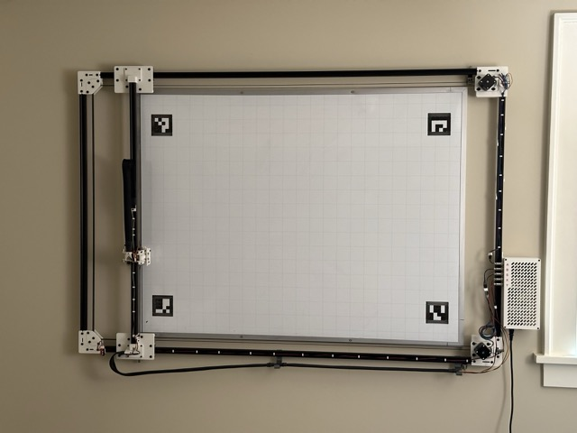

# whiteboard-plotter

A whiteboard plotter.

This is a functional whiteboard plotter, but the documentation here is a work in
progress. If you think you'd like to build one of these, and better instructions
would be helpful, please open an issue!

## Features

- 1139mm x 798mm print area
- 2x NEMA 17 motors
- Core XY
- Largely made from PLA printed parts and 20x20mm v-slot aluminum extrusion

## Non-printed parts

A partial list of parts that need to be purchased. This is a work in progress.

| Part                                      | Quantity | Purchase options                                                                                                                                                      | Notes                                          |
| ----------------------------------------- | -------- | --------------------------------------------------------------------------------------------------------------------------------------------------------------------- | ---------------------------------------------- |
| FluidNCTMC2209 Pen Laser V2               | 1        | [Tindie](https://www.tindie.com/products/33366583/tmc2209-penlaser-cnc-controller/), [Elecrow](https://www.elecrow.com/tmc2209-pen-laser-fluidnc-cnc-controller.html) |
| Mean Well LRS-50-24 power supply          | 1        | [Amazon](https://www.amazon.com/LRS-50-24-Switching-Supply-Single-Output/dp/B019GYODAS)                                                                               |
| C14 power inlet, switched                 | 1        | [Amazon](https://www.amazon.com/FILSHU-Rocker-Switch-Socket-Module/dp/B09LGX9MQX)                                                                                     |
| 20x20mm v-slot aluminum extrusion, 1000mm | 3        |                                                                                                                                                                       |
| 20x20mm v-slot aluminum extrusion, 1500mm | 2        |                                                                                                                                                                       |
| NEMA 17 stepper motor                     | 2        |                                                                                                                                                                       |
| 9g servo                                  | 1        |                                                                                                                                                                       |
| 1/8" brass rod, ??mm                      | 2        |
| Spring from a clicky pen                  | 1        |                                                                                                                                                                       | find one that can fit around the brass rod     |
| V-slot wheels                             | 12       |
| 6mm GT2 Belt, ~6m                         | 2        |
| Idler pulley, toothless                   | ?        |
| Idler pulley, toothed                     | ?        |
| Drive pulley                              | 2        |                                                                                                                                                                       | should fit on your stepper motor shaft         |
| M3 hardware                               | lots     |                                                                                                                                                                       | various lengths, mostly socket cap             |
| M5 hardware                               | lots     |                                                                                                                                                                       | various lengths, mostly button cap             |
| Tape measure, preferrably used            | 1        |                                                                                                                                                                       | used for the drag chains                       |
| Mesh wire loom                            | ~3m      |                                                                                                                                                                       | wraps tape measure drag chains                 |
| Whiteboard                                | 1        |                                                                                                                                                                       | ~3' x ~4'                                      |
| Markers                                   | ?        |                                                                                                                                                                       | Quartet bullet tip dry erase markers are great |
| Wire                                      | lots     |                                                                                                                                                                       |                                                |
| Connectors                                | ?        |                                                                                                                                                                       | dupont? jst-xh? airplane?                      |

## Printed parts

| Part                             | Quantity | Notes                                                           |
| -------------------------------- | -------- | --------------------------------------------------------------- |
| a_motor_corner_bracket.stl       | 1        | support needed inside the channels that receieve aluminum rails |
| actuator_plate.stl               | 1        |
| b_motor_corner_bracket.stl       | 1        | support needed inside the channels that receieve aluminum rails |
| bottom_gantry_carriage.stl       | 1        |
| bottom_gantry_carriage_cover.stl | 1        | probably bridgeable without support                             |
| enclosure_body.stl               | 1        |
| enclosure_bracket.stl            | 1        |
| enclosure_top.stl                | 1        |
| gantry_rail_drag_chain_block.stl | 1        |
| helical_gear.stl                 | 1        |
| helical_rack.stl                 | 1        |
| hot_shoe_mount.stl               | 1        |
| idler_corner_bracket.stl         | 2        |
| idler_plate_back.stl             | 2        |
| idler_plate_front.stl            | 2        |
| marker_clamp.stl                 | 1        | print more if you have more markers                             |
| motor_plate.stl                  | 2        |
| rod_end_block.stl                | 2        |
| servo_bracket.stl                | 1        |
| shuttle.stl                      | 1        |
| top_gantry_carriage.stl          | 1        |
| top_gantry_carriage_cover.stl    | 1        | probably bridgeable without support                             |
| y_carriage.stl                   | 1        |
| y_carriage_brace_bottom.stl      | 1        |
| y_carriage_brace_top.stl         | 1        |
| y_carriage_drag_chain_block.stl  | 1        |
| y_undercarriage.stl              | 1        |

## Assembly

This is a rough outline of the steps.

1. Fixed parts
   1. Print the parts
   2. Assemble the frame
   3. Mount the whiteboard and frame to the wall, such that the frame is ??mm
      from the whiteboard
2. Carriages and gantry
   1. Attach the gantry carriages to the horizontal frame rails
   2. Attach the gantry rail to the gantry carriages
   3. Attach the y carriage to the gantry rail
3. Belts and motors
   1. Attach the motors to the motor plates
   2. Route the belt
   3. Attach the motor plates to the corner braces loosely
   4. Tension the belt by pulling the motor plates away from the center of the
      machine
   5. Tighten the motor plates to the corner braces
4. Enclosure
   1. Wire from the power inlet to the power supply
   2. Wire from the power supply to the controller
   3. Wire from the controller to the five ports
5. Wiring
   1. Attach the drag chains
   2. Wire from motors to enclosure
   3. Wire from servo to enclosure
   4. Attach end stops
   5. Wire from end stops to enclosure
6. Configure
   1. Install the fluidnc yaml config file.
